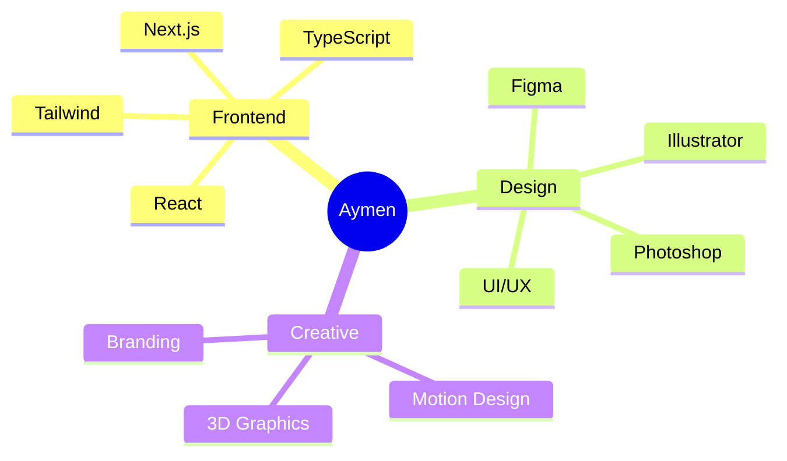

<div align="center">


</div>

<div align="center">

### ⚡ Creative Developer • Digital Alchemist • Design Engineer ⚡


</div>

```ascii
╔══════════════════════════════════════════════════════════════╗
║  "Design is intelligence made visible" - Alina Wheeler      ║
║                                                              ║
║  Frontend Wizard 🪄 | UI/UX Architect 🎨 | Brand Sorcerer ✨  ║
╚══════════════════════════════════════════════════════════════╝
```

---

<div align="center">

## 🎮 GAME STATS

<table>
<tr>
<td width="50%">

### 🎯 ABOUT PLAYER

```yaml
name: Aymen Zemrani
class: Full-Stack Creative
level: Senior
xp_points: 10000+
special_abilities:
  - Pixel Perfect Vision 👁️
  - Code Wizardry 🧙‍♂️
  - Design Alchemy ✨
  - Problem Solving 🧩
current_quest: "Building the future, one commit at a time"
status: Available for epic collaborations
```

</td>
<td width="50%">

### ⚔️ SKILL TREE



</td>
</tr>
</table>

</div>

---

<div align="center">

## 🔮 TECH ARSENAL


</div>

<div align="center">

### 🎨 Design Tools • ⚡ Development Stack • 🚀 Deployment Wizardry

</div>

---

<div align="center">

## 📊 BATTLE STATISTICS


</div>

---

<div align="center">

## 🏆 ACHIEVEMENTS UNLOCKED


</div>

---

<div align="center">

## 💬 WISDOM OF THE ANCIENTS


</div>

---

<div align="center">

## 🌐 CONNECT WITH THE DEVELOPER

<a href="https://linkedin.com/in/AymenZemrani"></a>
<a href="https://behance.net/aymanxmello"></a>
<a href="https://instagram.com/ayman_x_mello"></a>
<a href="https://youtube.com/@Ayman_x_mello"></a>
<a href="https://facebook.com/AymanElZmrani"></a>

</div>

---

<div align="center">

## 🎯 CURRENT SIDE QUESTS

<table>
<tr>
<td align="center" width="33%">

### 🌟 Project Alpha
**Next-Gen Portfolio**  
`React` `Three.js` `GSAP`  
*Pushing the boundaries of web design*

</td>
<td align="center" width="33%">

### 🚀 Project Beta
**E-Commerce Platform**  
`Next.js` `Stripe` `Tailwind`  
*Seamless shopping experience*

</td>
<td align="center" width="33%">

### 🎨 Project Gamma
**Design System**  
`Figma` `Storybook` `TypeScript`  
*Scalable component library*

</td>
</tr>
</table>

</div>

---

<div align="center">

### 🎪 FUN FACTS ABOUT ME

```diff
+ 💻 I code in my sleep (literally dream in React components)
+ ☕ Coffee dependency: CRITICAL (5 cups/day minimum)
+ 🎮 Gaming enthusiast & Easter egg hunter
+ 🌙 Night owl - Best code happens at 2 AM
+ 🎵 Coding soundtrack: Lo-fi beats & Synthwave
+ 🍕 Pizza is a food group, fight me
```

</div>

---

<div align="center">

## 📈 CODING ACTIVITY

<!--START_SECTION:waka-->
```text
JavaScript   12 hrs 30 mins  ████████████░░░░░░░░░  55.2%
React        5 hrs 15 mins   ████░░░░░░░░░░░░░░░░░  23.1%
CSS          3 hrs 10 mins   ███░░░░░░░░░░░░░░░░░░  14.0%
HTML         1 hr 20 mins    █░░░░░░░░░░░░░░░░░░░░   5.9%
Other        25 mins         ░░░░░░░░░░░░░░░░░░░░░   1.8%
```
<!--END_SECTION:waka-->

</div>

---

<div align="center">

## 🐍 CONTRIBUTION SNAKE

<picture>
  <source media="(prefers-color-scheme: dark)" srcset="https://raw.githubusercontent.com/Aymanxmello/Aymanxmello/output/github-contribution-grid-snake-dark.svg">
  <source media="(prefers-color-scheme: light)" srcset="https://raw.githubusercontent.com/Aymanxmello/Aymanxmello/output/github-contribution-grid-snake.svg">
  
</picture>

</div>

---

<div align="center">

### 💼 OPEN FOR OPPORTUNITIES

```javascript
const availability = {
  status: "🟢 Available",
  looking_for: ["Freelance Projects", "Collaborations", "Cool Ideas"],
  interests: ["Web3", "AI Integration", "Creative Coding"],
  timezone: "GMT+1 (Casablanca)",
  response_time: "< 24 hours",
  let_build_something_awesome: true
};
```

</div>

---

<div align="center">

### 🎨 "Code is like humor. When you have to explain it, it's bad." - Cory House


</div>
