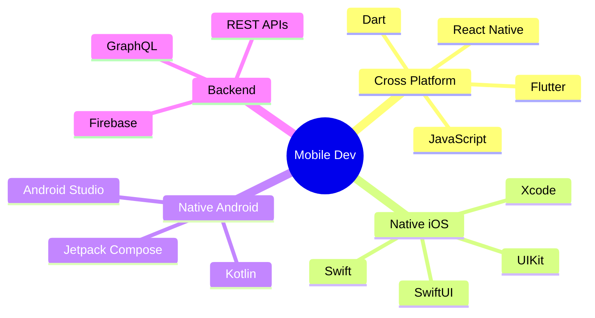
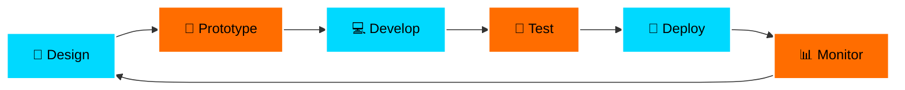

<div align="center">


</div>

<div align="center">

### 📱 Mobile App Developer • Flutter Expert • UI/UX Specialist 🚀


</div>

```ascii
╔════════════════════════════════════════════════════════════════╗
║  "The best mobile apps are invisible - they just work"       ║
║                                                                ║
║  📱 iOS & Android Architect • 🎨 Mobile UI Master • ⚡ Native Pro ║
╚════════════════════════════════════════════════════════════════╝
```

---

<div align="center">

## 🎮 DEVELOPER PROFILE

<table>
<tr>
<td width="50%">

### 📱 MOBILE DEV STATS

```yaml
developer: Aymen Zemrani
specialization: Mobile Development
platforms:
  - iOS (Swift, SwiftUI)
  - Android (Kotlin, Jetpack Compose)
  - Cross-Platform (Flutter, React Native)
experience: 5+ years
apps_published: 15+
total_downloads: 100K+
avg_rating: 4.7⭐
current_status: Building the next big thing
available_for: Freelance & Collaborations
```

</td>
<td width="50%">

### 🎯 SKILL MATRIX



</td>
</tr>
</table>

</div>

---

<div align="center">

## 🛠️ MOBILE TECH STACK

### Cross-Platform Frameworks


### Native Development


### Backend & Tools


### Design & Prototyping


### Version Control & CI/CD


</div>

---

<div align="center">

## 📊 GITHUB ANALYTICS


</div>

---

<div align="center">

## 🏆 ACHIEVEMENTS & MILESTONES


</div>

---

<div align="center">

## 📱 FEATURED MOBILE PROJECTS

<table>
<tr>
<td align="center" width="33%">

### 📲 FitTrack Pro


**Fitness & Health Tracker**
- 50K+ Downloads
- 4.8⭐ Rating
- Real-time workout tracking
- Social features
- ML-powered insights

</td>
<td align="center" width="33%">

### 🛒 ShopEase


**E-Commerce Platform**
- 30K+ Active Users
- 4.6⭐ Rating
- Seamless checkout
- Push notifications
- Payment gateway integration

</td>
<td align="center" width="33%">

### 🎵 BeatFlow


**Music Streaming App**
- iOS Featured App
- 4.9⭐ Rating
- Offline playback
- Custom playlists
- Social sharing

</td>
</tr>
</table>

</div>

---

<div align="center">

## 💡 MOBILE DEVELOPMENT EXPERTISE

</div>

<table>
<tr>
<td width="50%">

### 📱 Core Competencies

```diff
✓ Cross-Platform Development
  - Flutter & Dart mastery
  - React Native expertise
  - Code reusability 95%+

✓ Native iOS Development
  - Swift & SwiftUI
  - UIKit frameworks
  - App Store optimization

✓ Native Android Development
  - Kotlin & Java
  - Jetpack Compose
  - Material Design 3

✓ Performance Optimization
  - App size reduction
  - Battery efficiency
  - Smooth 60fps animations
```

</td>
<td width="50%">

### 🎨 UI/UX Excellence

```diff
✓ Mobile-First Design
  - Responsive layouts
  - Adaptive components
  - Touch-friendly interfaces

✓ Animation & Motion
  - Micro-interactions
  - Gesture handling
  - Custom transitions

✓ Accessibility
  - WCAG compliance
  - Screen reader support
  - Voice control

✓ Design Systems
  - Component libraries
  - Consistent theming
  - Dark mode support
```

</td>
</tr>
</table>

---

<div align="center">

## 🔧 DEVELOPMENT WORKFLOW

</div>



---

<div align="center">

## 📈 APP METRICS & PERFORMANCE

<table>
<tr>
<td align="center" width="25%">

### 📱 Apps Published
## 15+
*iOS & Android*

</td>
<td align="center" width="25%">

### ⬇️ Total Downloads
## 100K+
*Across all platforms*

</td>
<td align="center" width="25%">

### ⭐ Average Rating
## 4.7/5.0
*User satisfaction*

</td>
<td align="center" width="25%">

### 👥 Active Users
## 50K+
*Monthly active*

</td>
</tr>
</table>

</div>

---

<div align="center">

## 📱 TESTING & QUALITY ASSURANCE


</div>

---

<div align="center">

## 💬 DEVELOPER WISDOM


</div>

---

<div align="center">

## 🌐 CONNECT WITH ME

<a href="https://linkedin.com/in/AymenZemrani"></a>
<a href="https://behance.net/aymanxmello"></a>
<a href="https://instagram.com/ayman_x_mello"></a>
<a href="https://youtube.com/@Ayman_x_mello"></a>
<a href="https://facebook.com/AymanElZmrani"></a>

### 📧 Email: contact@aymenzemrani.dev | 📱 Available for mobile projects worldwide

</div>

---

<div align="center">

## 🎯 CURRENTLY WORKING ON

```javascript
const currentProjects = {
  project1: {
    name: "HealthCare+ Mobile App",
    tech: ["Flutter", "Firebase", "ML Kit"],
    status: "🟢 In Development",
    progress: "75%",
    features: ["Telemedicine", "AI Diagnostics", "Health Tracking"]
  },
  project2: {
    name: "CryptoWallet Pro",
    tech: ["React Native", "Blockchain API", "Biometrics"],
    status: "🟡 Beta Testing",
    progress: "90%",
    features: ["Multi-currency", "Secure Transactions", "Portfolio Analytics"]
  },
  learning: ["Jetpack Compose", "SwiftUI 5", "Flutter 3.16", "AI/ML Integration"]
};
```

</div>

---

<div align="center">

### 📱 MOBILE DEVELOPMENT PRINCIPLES

```diff
+ 🎯 User-First: Every feature must serve the user
+ ⚡ Performance: 60fps is the minimum, not the goal
+ 🎨 Design: Beauty and function go hand in hand
+ 🔒 Security: User data protection is non-negotiable
+ 📊 Data-Driven: Metrics guide every decision
+ 🧪 Test Everything: If it's not tested, it's broken
+ 🚀 Ship Fast: Iterate, learn, improve
```

</div>

---

<div align="center">

## 🐍 CONTRIBUTION ACTIVITY

<picture>
  <source media="(prefers-color-scheme: dark)" srcset="https://raw.githubusercontent.com/Aymanxmello/Aymanxmello/output/github-contribution-grid-snake-dark.svg">
  <source media="(prefers-color-scheme: light)" srcset="https://raw.githubusercontent.com/Aymanxmello/Aymanxmello/output/github-contribution-grid-snake.svg">
  
</picture>

</div>

---

<div align="center">

## 💼 HIRE ME FOR

<table>
<tr>
<td align="center">

### 📱
**Mobile App Development**
iOS, Android, Cross-Platform

</td>
<td align="center">

### 🎨
**UI/UX Design**
Figma, User Research, Prototyping

</td>
<td align="center">

### ⚡
**App Optimization**
Performance, Battery, Size

</td>
<td align="center">

### 🔧
**Maintenance & Support**
Updates, Bug Fixes, Features

</td>
</tr>
</table>

</div>

---

<div align="center">

### 🌟 AVAILABILITY STATUS

```typescript
interface Availability {
  status: "🟢 Available";
  hourlyRate: "$50-100/hour";
  projectTypes: ["Full-Time", "Part-Time", "Contract", "Consulting"];
  timezone: "GMT+1 (Casablanca)";
  responseTime: "< 12 hours";
  minProjectSize: "2 weeks";
  preferredContact: "LinkedIn DM or Email";
}

const letsBuildSomethingAmazing = true; // Always! 🚀
```

</div>

---

<div align="center">

### 📱 "The details are not the details. They make the design." - Charles Eames


</div>
