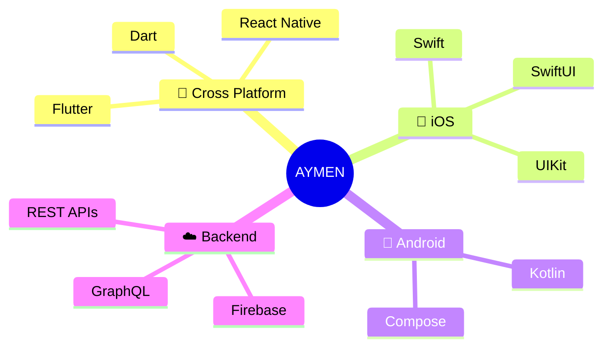
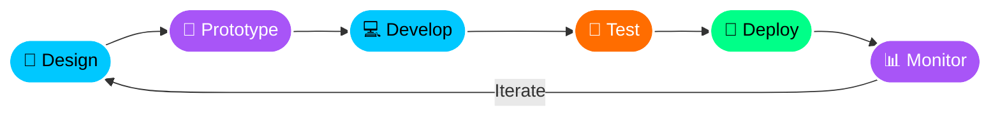

<div align="center">

<!-- HEADER BANNER -->


</div>

<div align="center">

<!-- TYPING ANIMATION -->


</div>

---

<div align="center">

```
╔══════════════════════════════════════════════════════════════════╗
║  ░░░░░░  DEVELOPER TERMINAL  ░░░░░░                             ║
║                                                                  ║
║  $ whoami                                                        ║
║  > aymen_zemrani — Mobile Developer, Flutter Expert, UI Wizard  ║
║                                                                  ║
║  $ cat philosophy.txt                                            ║
║  > "The best mobile apps are invisible — they just work"        ║
║                                                                  ║
║  $ status                                                        ║
║  > 🟢 ONLINE · Building the next big thing · GMT+1 Casablanca   ║
╚══════════════════════════════════════════════════════════════════╝
```

</div>

---

<div align="center">

## 📊 LIVE STATS

<table>
<tr>
<td align="center" width="25%">


### `15+`
**Apps Live**
*iOS & Android*

</td>
<td align="center" width="25%">

### `100K+`
**Downloads**
*All platforms*

</td>
<td align="center" width="25%">

### `4.7 ⭐`
**Avg Rating**
*User satisfaction*

</td>
<td align="center" width="25%">

### `50K+`
**Monthly Active**
*Users worldwide*

</td>
</tr>
</table>

</div>

---

<div align="center">

## 🎮 DEVELOPER PROFILE

</div>

<table>
<tr>
<td width="55%">

### 🖥️ MOBILE DEV STATS

```yaml
# profile.yaml
developer:    Aymen Zemrani
role:         Mobile Development Specialist
location:     Casablanca, Morocco · GMT+1

platforms:
  - ▓▓▓▓▓▓▓▓▓▓ Flutter / Dart      96%
  - ▓▓▓▓▓▓▓▓▒▒ Swift / SwiftUI     88%
  - ▓▓▓▓▓▓▓▓▒▒ Kotlin / Compose    85%
  - ▓▓▓▓▓▓▓▓▒▒ React Native        80%
  - ▓▓▓▓▓▓▓▓▓▒ UI/UX Design        90%

experience:   5+ years
apps_live:    15+
downloads:    100K+
avg_rating:   4.7 ⭐
status:       🟢 Available
```

</td>
<td width="45%">

### 🎯 SKILL MAP


```mermaid
mindmap
  root((AYMEN))
    📱 Cross Platform
      Flutter
      React Native
      Dart
    🍎 iOS
      Swift
      SwiftUI
      UIKit
    🤖 Android
      Kotlin
      Compose
    ☁️ Backend
      Firebase
      GraphQL
      REST APIs
```

</td>
</tr>
</table>

---

<div align="center">

## 🛠️ TECH ARSENAL

### ▸ Cross-Platform


### ▸ Native Mobile


### ▸ Backend & Cloud


### ▸ Design & Workflow


</div>

---

<div align="center">

## 📈 GITHUB METRICS


</div>

---

<div align="center">

## 🏆 TROPHIES


</div>

---

<div align="center">

## 📱 FEATURED PROJECTS

</div>

<table>
<tr>
<td align="center" width="33%">

### 📲 FitTrack Pro

```
┌─────────────────┐
│  ░░ FitTrack ░░ │
│                 │
│  💪 Workouts    │
│  📊 Analytics   │
│  🤖 ML Insights │
│                 │
│  ██████████ 87% │
└─────────────────┘
```


**50K+ Downloads · ⭐ 4.8**

</td>
<td align="center" width="33%">

### 🛒 ShopEase

```
┌─────────────────┐
│  ░░ ShopEase ░░ │
│                 │
│  🛍️ Products    │
│  💳 Checkout    │
│  🔔 Push Notif  │
│                 │
│  ██████████ 92% │
└─────────────────┘
```


**30K+ Active Users · ⭐ 4.6**

</td>
<td align="center" width="33%">

### 🎵 BeatFlow

```
┌─────────────────┐
│  ░░ BeatFlow ░░ │
│                 │
│  🎵 Streaming   │
│  📱 Offline     │
│  🔗 Social      │
│                 │
│  ██████████ 99% │
└─────────────────┘
```


**iOS Featured App · ⭐ 4.9**

</td>
</tr>
</table>

---

<div align="center">

## 🔧 DEVELOPMENT WORKFLOW

</div>


```mermaid
graph LR
    A([📝 Design]) --> B([🎨 Prototype])
    B --> C([💻 Develop])
    C --> D([🧪 Test])
    D --> E([🚀 Deploy])
    E --> F([📊 Monitor])
    F -->|Iterate| A

    style A fill:#00C8FF,stroke:#fff,stroke-width:2px,color:#000,rx:8
    style B fill:#A855F7,stroke:#fff,stroke-width:2px,color:#fff,rx:8
    style C fill:#00C8FF,stroke:#fff,stroke-width:2px,color:#000,rx:8
    style D fill:#FF6D00,stroke:#fff,stroke-width:2px,color:#fff,rx:8
    style E fill:#00FF88,stroke:#fff,stroke-width:2px,color:#000,rx:8
    style F fill:#A855F7,stroke:#fff,stroke-width:2px,color:#fff,rx:8
```

---

<div align="center">

## 🎯 CURRENTLY BUILDING

</div>

```javascript
// currently_building.js  ·  last updated: 2025

const projects = {

  "HealthCare+ 🏥": {
    tech:     ["Flutter", "Firebase", "ML Kit"],
    status:   "🟢 In Development",
    progress: "▓▓▓▓▓▓▓▓▒▒  75%",
    features: ["Telemedicine", "AI Diagnostics", "Health Tracking"]
  },

  "CryptoWallet Pro 🔐": {
    tech:     ["React Native", "Blockchain API", "Biometrics"],
    status:   "🟡 Beta Testing",
    progress: "▓▓▓▓▓▓▓▓▓▒  90%",
    features: ["Multi-currency", "Secure Tx", "Portfolio Analytics"]
  },

};

const learning = ["Jetpack Compose", "SwiftUI 6", "Flutter 4", "AI/ML on Device"];

export const letsBuildSomethingAmazing = true; // always 🚀
```

---

<div align="center">

## 💡 DEV PRINCIPLES

</div>

```diff
+ 🎯  User-First    ··· Every feature must serve the user
+ ⚡  Performance   ··· 60fps is the minimum, not the goal  
+ 🎨  Design        ··· Beauty and function go hand in hand
+ 🔒  Security      ··· User data protection is non-negotiable
+ 📊  Data-Driven   ··· Metrics guide every decision
+ 🧪  Test First    ··· If it's not tested, it's broken
+ 🚀  Ship Fast     ··· Iterate, learn, improve
```

---

<div align="center">

## 🐍 CONTRIBUTION SNAKE

<picture>
  <source media="(prefers-color-scheme: dark)" srcset="https://raw.githubusercontent.com/Aymanxmello/Aymanxmello/output/github-contribution-grid-snake-dark.svg">
  <source media="(prefers-color-scheme: light)" srcset="https://raw.githubusercontent.com/Aymanxmello/Aymanxmello/output/github-contribution-grid-snake.svg">
  
</picture>

</div>

---

<div align="center">

## 📱 TESTING & CI/CD


</div>

---

<div align="center">

## 💼 HIRE ME FOR

<table>
<tr>
<td align="center" width="25%">

```
  📱
▓▓▓▓▓▓▓▓
```
**Mobile Dev**
iOS · Android
Cross-Platform

</td>
<td align="center" width="25%">

```
  🎨
▓▓▓▓▓▓▓▓
```
**UI/UX Design**
Figma · Research
Prototyping

</td>
<td align="center" width="25%">

```
  ⚡
▓▓▓▓▓▓▓▓
```
**Optimization**
Performance
Battery · Size

</td>
<td align="center" width="25%">

```
  🔧
▓▓▓▓▓▓▓▓
```
**Maintenance**
Updates · Bugs
New Features

</td>
</tr>
</table>

</div>

---

<div align="center">

## 🌟 AVAILABILITY

```typescript
// availability.ts

interface AymenZemrani {
  status:          "🟢 Available Now";
  hourlyRate:      "$50 – $100 / hour";
  projectTypes:    ["Full-Time", "Part-Time", "Contract", "Consulting"];
  timezone:        "GMT+1 · Casablanca, Morocco";
  responseTime:    "< 12 hours";
  minProjectSize:  "2 weeks";
  contact:         "LinkedIn DM or contact@aymenzemrani.dev";
}

const ready: AymenZemrani["status"] = "🟢 Available Now";
```

</div>

---

<div align="center">

## 🌐 CONNECT

<a href="https://linkedin.com/in/AymenZemrani">
  
</a>
&nbsp;
<a href="https://behance.net/aymanxmello">
  
</a>
&nbsp;
<a href="https://instagram.com/ayman_x_mello">
  
</a>
&nbsp;
<a href="https://youtube.com/@Ayman_x_mello">
  
</a>
&nbsp;
<a href="https://facebook.com/AymanElZmrani">
  
</a>
&nbsp;
<a href="mailto:contact@aymenzemrani.dev">
  
</a>

<br/><br/>

### 💬 *"The details are not the details. They make the design."* — Charles Eames

<br/>


<br/><br/>


</div>
